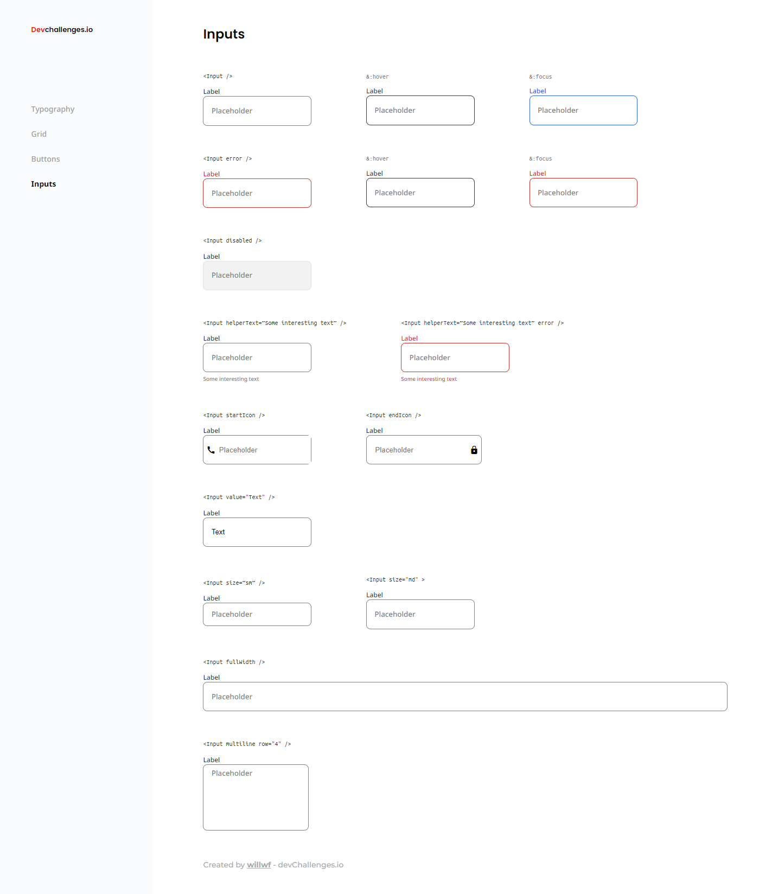

<!-- Please update value in the {}  -->

<h1 align="center">Input Component</h1>

<div align="center">
   Solution for the Input Component challenge from  <a href="http://devchallenges.io" target="_blank">Devchallenges.io</a>.
</div>

<div align="center">
  <h3>
    <a href="https://{your-demo-link.your-domain}">
      Demo
    </a>
    <span> | </span>
    <a href="https://{your-url-to-the-solution}">
      Solution
    </a>
    <span> | </span>
    <a href="https://devchallenges.io/challenges/TSqutYM4c5WtluM7QzGp">
      Challenge
    </a>
  </h3>
</div>

<!-- TABLE OF CONTENTS -->

## Table of Contents

- [Overview](#overview)
  - [Built With](#built-with)
- [Features](#features)
- [How to use](#how-to-use)
- [Links](#links)
- [Authors](#authors)

<!-- OVERVIEW -->

## Overview

**In this project I was able to practice a lot with inputs fields and good ways of styling. I got stuck for some time in a lot of things that I thought it wasn't take too much time. It was a great exercise.**

Challenge: Create a reusable input with all the states in the design and a page displaying all the states. You can work on the same project with other design system challenges. Use Front-end libraries like React or Vue. Don’t look at the existing solution. Fulfill user stories below:

- User story: I can see error state
- User story: I can choose to disable input
- User story: I can choose to have helper text
- User story: I can choose to have an icon on the left or right (Use Google Icon and at least 5 variants)
- User story: I can have different input sizes
- User story: I can have different colors
- User story: I can choose to have input take the width of the parent
- User story: I can have multiline input like a textarea
- User story: When I hover or focus, I can see visual indicators
- User story: I can still access all input attributes
- User story (optional): Show input in a similar way like the design or use Storybook. Otherwise, showing the input in multiple states is enough



### Built With

- Flexbox
- Css Modules
- Semantic HTML5 markup
- [Vite.js](https://vitejs.dev/) - Bundler JS
- [React](https://reactjs.org/)

## Features

<!-- List the features of your application or follow the template. Don't share the figma file here :) -->

This application/site was created as a submission to a [DevChallenges](https://devchallenges.io/challenges) challenge. The [challenge](https://devchallenges.io/challenges/TSqutYM4c5WtluM7QzGp) was to build an application to complete the given user stories.

## How To Use

<!-- Example:  -->

To clone and run this application, you'll need [Git](https://git-scm.com) and [Node.js](https://nodejs.org/en/download/) (which comes with [npm](http://npmjs.com)) installed on your computer. From your command line:

```bash
# Clone this repository
$ git clone https://github.com/Willwf/input-component

# Install dependencies
$ npm install

# Run the app
$ npm run dev
```

## 🔗 Links

[](https://www.linkedin.com/in/williamfirmino/)
[](https://twitter.com/Williamwf)

## Authors

- [@Willwf](https://www.github.com/Willwf)
